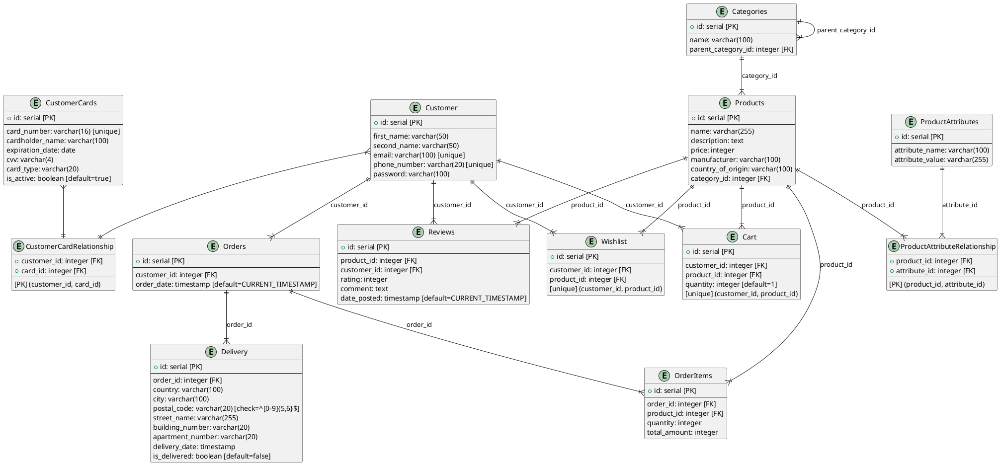

# БД

## Интернет-магазин электроники

### ER-диаграмма

```plantuml
@startuml

entity "Customer" as customer {
  +id: serial [PK]
  --
  first_name: varchar(50)
  second_name: varchar(50)
  email: varchar(100) [unique]
  phone_number: varchar(20) [unique]
  password: varchar(100)
}

entity "CustomerCards" as customer_cards {
  +id: serial [PK]
  --
  card_number: varchar(16) [unique]
  cardholder_name: varchar(100)
  expiration_date: date
  cvv: varchar(4)
  card_type: varchar(20)
  is_active: boolean [default=true]
}

entity "CustomerCardRelationship" as customer_card_relationship {
  +customer_id: integer [FK]
  +card_id: integer [FK]
  --
  [PK] (customer_id, card_id)
}

entity "Categories" as categories {
  +id: serial [PK]
  --
  name: varchar(100)
  parent_category_id: integer [FK]
}

entity "ProductAttributes" as product_attributes {
  +id: serial [PK]
  --
  attribute_name: varchar(100)
  attribute_value: varchar(255)
}

entity "Products" as products {
  +id: serial [PK]
  --
  name: varchar(255)
  description: text
  price: integer
  manufacturer: varchar(100)
  country_of_origin: varchar(100)
  category_id: integer [FK]
}

entity "ProductAttributeRelationship" as product_attribute_relationship {
  +product_id: integer [FK]
  +attribute_id: integer [FK]
  --
  [PK] (product_id, attribute_id)
}

entity "Reviews" as reviews {
  +id: serial [PK]
  --
  product_id: integer [FK]
  customer_id: integer [FK]
  rating: integer
  comment: text
  date_posted: timestamp [default=CURRENT_TIMESTAMP]
}

entity "Cart" as cart {
  +id: serial [PK]
  --
  customer_id: integer [FK]
  product_id: integer [FK]
  quantity: integer [default=1]
  [unique] (customer_id, product_id)
}

entity "Wishlist" as wishlist {
  +id: serial [PK]
  --
  customer_id: integer [FK]
  product_id: integer [FK]
  [unique] (customer_id, product_id)
}

entity "Orders" as orders {
  +id: serial [PK]
  --
  customer_id: integer [FK]
  order_date: timestamp [default=CURRENT_TIMESTAMP]
}

entity "OrderItems" as order_items {
  +id: serial [PK]
  --
  order_id: integer [FK]
  product_id: integer [FK]
  quantity: integer
  total_amount: integer
}

entity "Delivery" as delivery {
  +id: serial [PK]
  --
  order_id: integer [FK]
  country: varchar(100)
  city: varchar(100)
  postal_code: varchar(20) [check=^[0-9]{5,6}$]
  street_name: varchar(255)
  building_number: varchar(20)
  apartment_number: varchar(20)
  delivery_date: timestamp
  is_delivered: boolean [default=false]
}

customer }|--|| customer_card_relationship
customer_cards }|--|| customer_card_relationship

categories ||--|{ categories : parent_category_id
categories ||--|{ products : category_id

products ||--|{ product_attribute_relationship : product_id
product_attributes ||--|{ product_attribute_relationship : attribute_id

products ||--|{ reviews : product_id
customer ||--|{ reviews : customer_id

customer ||--|{ cart : customer_id
products ||--|{ cart : product_id

customer ||--|{ wishlist : customer_id
products ||--|{ wishlist : product_id

customer ||--|{ orders : customer_id
orders ||--|{ order_items : order_id
products ||--|{ order_items : product_id

orders ||--|{ delivery : order_id

@enduml
```